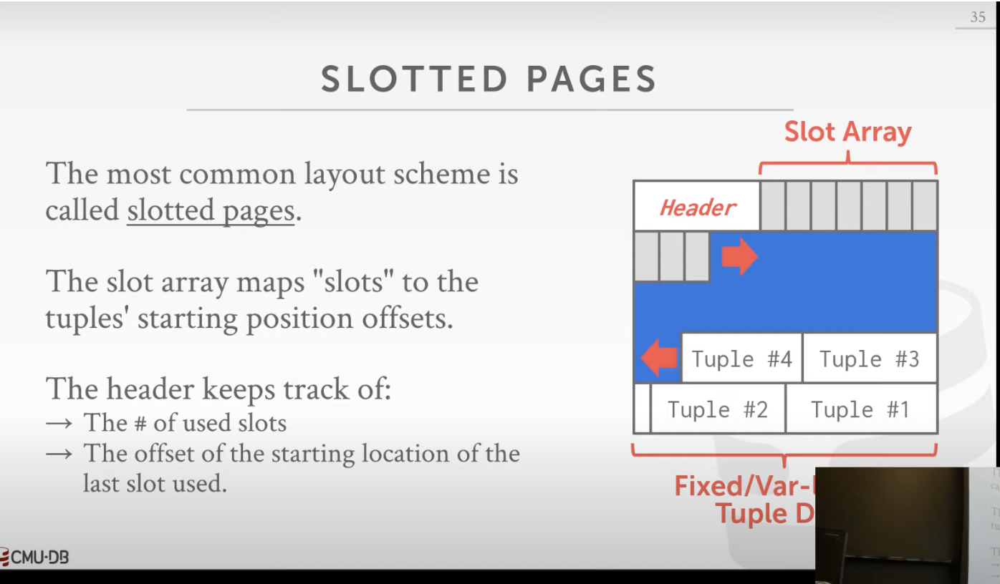

# Simple relational database

based on [CMU course](https://15445.courses.cs.cmu.edu/fall2019/) and [cstack course](https://cstack.github.io/db_tutorial/)

# Components
* query planning
* operator execution
* access methods
* buffer pool manager - we don't want to use memory mapped files and we don't want to use virtual memory - OS can interfere with us, we know better what's the context of these IOs. Buffer pool allows to maintain pages and flush them to the disk. OS also does not know the order of pages that need to go the file, it's a problem during concurrent writes
* storage manager/storage engine - component that maintains our DB files on disk

# Data on disk

## page
fixed sized block of data, can contain tuples, metadata, indexes, log etc.
It's good idea to not mix page types - for disaster recovery reasons
* hardeware pages on disk - 4k
* os pages 4k
* db pages 512-16kb - we care about these. Usually 4k, because these blocks can be atomic (write and flush to disk)

## file storage
DB is just a bunch of files on disk. SQLite is just one file, others are many files.
We still want to use OS's file system, historically there were attempts to use raw disk storage.

## page storage
heap file (usually page directory) - unordered collection of pages where tuples are stored in random order.
special page with mapping of page id and offsets. SUmmary what is where. Hash table page id -> location where to find it

## page layout
* header with metadata- page size, checksum, dbms version, transaction visibility, compression info
    * slot array after the header - list of offsets of next tuples. Data is filled from the end of page, slots from the begining
* data - can be tuple oriented or log structured
    * log structured file organisation - log of changes, inserts, updates, deletes etc. This is stored in the page. Less disk writes, recovery is easier. Append only works good on distributed filesystems (s3 is append only). Read become slow, we need to recreate the data (we need snapshots/compact and indexes)

tuple id (rowid, ctid etc) usually pageid + offset/slot

## tuple layout
tuple is a sequence of bytes in the page, schema will interpret that as rows.
tuple has also a little header like transaction id etc.

## data representation
* usually normal datatypes we have in C. Floats can be var precision (fast, because CPUs have instructions for that, but we have rounding errors) or fixed precission - slower but better for representing money or scientific results - no rounding errors.
* if the data is bigger than single page - we use overflow (Toast in postgres) page. instead of data for particular column, there's a pointer to next page with rest of the data. Or pointer to external file with the content - blob (binary large object) types.
* system catalogs - metadata about the databsae and its internals, tables, databases, metrics etc. just another tables for metadata. `INFORMATION_SCHEMA`. `\d` in postgres etc.
 
 ------------
 ## types/workloads of queries
 * OLTP - on line transaction processing - regular queries for an app, select from ordres etc.
 * OLAP - online analytical processing - long complex readonly queries with large data, lot of joins, high level analytics. Usually we don't index very much.
 * htap - hybric transaction + analytical processing - in the middle of both workload

 there are different storage models (`row`/`column storage`) that better suits different workloads. Tuples persisted as rows are better for OLTP, column storage is better for olap - pages contain columns

Usually oltp are local databased in the apps, then we have ETLs to shove it to OLAP data warehouse

 # Buffer Pool Managers
 * large chunk of memory we put our pages. Then we break these into frames (=pages). Page table - hash map that keeps track which page is in the memory at which offset + some metadata (dirty flag, pin/reference counter). Then we flush our buffer pool pages to disk.

* page directory - mapping from page ids to locations in databse files. This is persisted on the disk
*  `Lock` - for transactions. Protection for logical content. This is exposed to the user.
* `latch` - mutexes for critical sections. Low lvl primitive for securing operations

 when to evict page from memory?
* LRU with timestamp (we can put it in a queue or heap)
* clock - approximation of LRU in circular buffer, check if the page was accessed recently (refernce bit)
    * these methods are not good for sequential scans, then we want to evict most recently used
* LRU-K
* localization
* priority hints

## dirty pages
some query modified this page recently. We need to flush it to disk, then we can reuse. Only then we can evict pages from buffer pool manager

# Data structures

we can use them to store:
* internal metadata
* core storage
* temporaru data structures
* table indexes

**Index** - replica of some attributes of the table to do fast search. Speeds queries, but bigger memory usage, storage overhead and updates/inserts are longer.

`HashTable` for storing table data, metadata and for indexes (when doing `=`)

`B-tree`/`B+tree` - self balancing trees, sorted order, efficient search, seq access, insert, delete. Always `O(logn)`. For indexes -> fast searching when doing `>, >=, <, <=` etc. Like binary trees, but can't be tall and have multiple children.

`LSM-Trees` (Log Structured Merge Trees) are usually used by NoSQL databases. An LSM-Tree essentially takes a simple log and extends it by dumping the log to disk once it reaches a certain size (Commonly referred to as a “segment”).

# concurrency control

* lock - logical correctness, transaction control. ROllbacks
* latch - mutex, physical primitive to secure data structures. No rollbacks, this is for atomic code operations